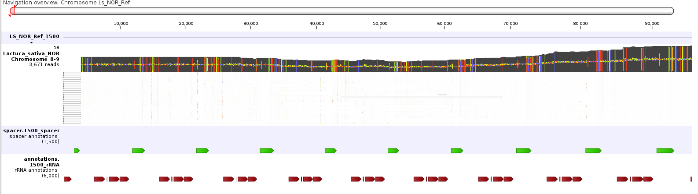
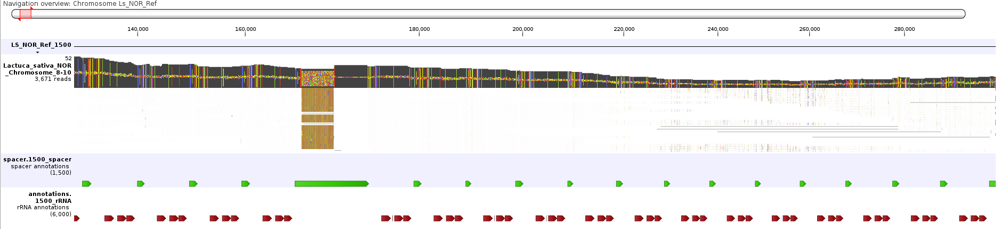
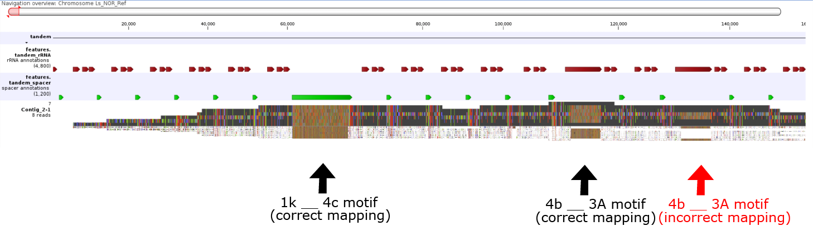
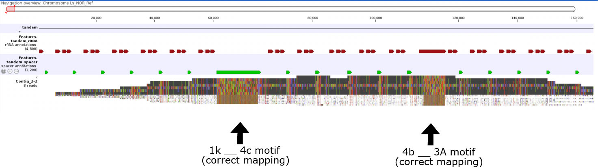
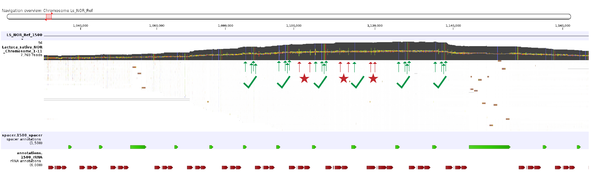

# 7. Creating Draft

Overview: generate a draft of the tandem repeat cluster DNA sequence by collapsing SAM alignments that are mapped by parsing where the blocks have been manually aligned in part 6.

```bash
mkdir drafts
```
<sub>\--------------------------------------------------------------------------------------------------------------------------------------------------------------------------- </sub>

### 7a. Generate SAM alignments onto tandem reference sequence.

First, tandem duplicate the reference sequence.\
Approximate the total segments that the longest single contig in *blocks/all.V1.stacks* has, then add 10 more (this number does not need to be exact).\
Replace \*TOTAL_COUNT\* with this value.
```bash
awk -v VAR1=*TOTAL_COUNT* 'NR == 1 {print $0} NR == 2 {for(i = 0; i < VAR1; i++) {printf($0)};}' reference/reference.fa > reference/reference.tandem.fa
```
Duplicate the annotations file. Replace \*REFERENCE_LEN\* with the length of your reference.
```bash
awk -v VAR1=*TOTAL_COUNT* -v VAR2=*REFERENCE_LEN* 'NR == 1 {print $0; next} {for(i = 0; i < VAR1; i++) {printf("%s\t%s\t%s\t%s\t%s\t%s\t%s\t%s\tSEGMENT=%d;%s\t\n",$1,$2,$3,$4 + VAR2*i,$5 + VAR2*i,$6,$7,$8,i+1,$9)};}' reference/features.gff > reference/features.tandem.gff
```

Combine all full length read datasets.
```bash
cat reads/long.fa.chop.oriented.fa reads/short.fa.chop.oriented.fa > reads/all.fa
```
Align the full length reads from all datasets to the duplicated reference sequence.
```bash
minimap2  -t *THREADS* --eqx -a -N 1 -E 2,0 --end-bonus=8 reference/reference.tandem.fa reads/all.fa > drafts/all.tandem.sam
```
> Here, custom parameters are used when aligning the reads to encourage alignments to produce large insertions where retrotransposons occur.
Retain only primary alignments.
```bash
awk 'and($2, 2304) == 0 {print}' drafts/all.tandem.sam > drafts/all.tandem.primary.sam
```

Note: These reads are being mapped to a tandem repeat, so their mapping position is chosen arbitrarily.

<sub>\--------------------------------------------------------------------------------------------------------------------------------------------------------------------------- </sub>

### 7b. Assign mapping positions from stacked blocks file.

```bash
python3 scripts/07_stackedBlocksToSAM.py blocks/all.V1.stacks drafts/all.tandem.primary.sam
```

For each contig header *contig_name*, one output file will be produced drafts/*contig_name*.sam.\
This file contains one read for each block in the input file, with adjusted mapping positions.\

Visualize each SAM file. The visualization could look something like this:


> *Start of Lettuce Chromosome 8 NOR region*. Visualization with CLC Genomics Workbench. Polymorphisms with respect to tandem duplicated reference indicated by colored bars. Note soft clipping of left-linker sequence on left border. Blocks are stacked with up to 58 depth.


> *Middle of Lettuce Chromosome 8 NOR region*. Visualization with CLC Genomics Workbench. Large insertion of mobile element.


<sub>\--------------------------------------------------------------------------------------------------------------------------------------------------------------------------- </sub>

### 7c. Tweak mapping positions after large deletion / insertion motifs.

Large insertions and deletions may offset mapping positions in downstream blocks.\
Consider these stacked blocks:

```tsv
    21	#### Contig_2
    22	# Adopted from assembly of chromosome 1 NOR in lettuce
    23	
    24	acdd29f0-6088-4f15-bde1-3b5feeee8fa0    	l	94020  	--	--	15	--		   4C 4C 4C 4c 4c 1k __ 4c 4c                                                 	4A 4a 4A 4a 4a 3a __ 4a 4a                                                 
    25	45deef91-e9ea-4810-98f0-52573132833c    	l	127339 	--	--	17	--		      4c 4c 4C 4c 1k __ 4c 4c 4C 4c 4c 4b                                        	4a 4a 4A 4a 3a __ 4a 4a 4A 4a 4a 4a                                        
    26	43e8b987-6b98-4657-ad70-8cd5ffd2f5d1    	l	172846 	--	--	12	--		            4C 4c 1k __ 4c 4C 4c 4C 4C 4B __ 3A 5a 5a 5A 6D 6d 6d 6d                   	4a 4a 3a __ 4a 4A 4a 4a 4a 4a __ 3A 5a 5a 5A 5D 5d 5d 5d                   
    27	6a79d732-37e9-4441-ae71-f38714ba7bf7    	l	119802 	--	--	18	--		                  1k __ 4c 4c 4c 4c 4c 4b __ 3A 5a 5a 6d                                     	3a __ 4a 4a 4a 4a 4a 4a __ 3A 5a 5a 5d                                     
    28	995458f7-f1f1-4486-b4c8-686d5a9a1dbd    	l	168857 	--	--	13	--		         4C 4C 4c 1k __ 4c 4C 4c 4c 4C 4b __ 3A 5A 5a 6D 6D 6d                      	4A 4A 4a 3a __ 4a 4A 4a 4a 4A 4a __ 3A 5A 5a 5D 5D 5d                      
    29	fc9b176f-0a65-41d4-b05f-17f8c50afca0    	l	137969 	--	--	16	--		            4C 4c 1k __ 4c 4C 4C 4C 4C 4B __ 3A 5a 5a 6D                               	4A 4a 3a __ 4a 4A 4A 4A 4A 4a __ 3A 5a 5a 5D                               
    30	89e3f606-9c33-45d1-bf13-501e6ccb3a83    	l	99200  	--	--	 7	--		                                 4c 4c 4b __ 3A 5a 5a 6d 6d 6d 6d                                           	4a 4a 4a __ 3A 5a 5a 5d 5d 5d 5d                                           
    31	9bfd6db4-35a4-41c1-b963-b224652ce643    	l	95009  	--	--	 8	--		                              4c 4c 4c 4b __ 3A 5a 5a 6D 6D                                              	4a 4a 4a 4a __ 3A 5a 5a 5d 5d                                              
```

The blocks appear to be correctly aligned. As it turns out, the mapping positions blocks on line 30 and 31 are actually off by two segments:


> For the "4b __ 3A" motif (a large mobile element insertion), most of the blocks are stacking correctly in the Contig_2.sam file. However, two of these blocks (lines 30 and 31) are mapping two segments to the right.

This occurs because of original the motif "1k __ 4c":
- While this motif consumes 3 segments as a block, it only represents 1 actual segment in the alignment of the read.
- The "__" segment is the undetected segment, which relates to a 14,000 base pair insertion.
- The "1k" and "4c" segments come from the truncated segments to the left and right of the insertion that were found when the read was chopped into segments.
- In order to correctly map any read that is positioned past this segment, its **shift** field for that block must be set to -2. This value tells the parser to shift those blocks left to segments when determining the mapping position.
  - This field allows the blocks to appear stacked (visually) in the stacked blocks file, while mapping correctly when converted to SAM.

Consider this adjustment (note the -2 on lines 30 and 31):
```tsv
    21	#### Contig_2
    22	# Adopted from assembly of chromosome 1 NOR in lettuce
    23	
    24	acdd29f0-6088-4f15-bde1-3b5feeee8fa0    	l	94020  	--	--	15	--		   4C 4C 4C 4c 4c 1k __ 4c 4c                                                 	4A 4a 4A 4a 4a 3a __ 4a 4a                                                 
    25	45deef91-e9ea-4810-98f0-52573132833c    	l	127339 	--	--	17	--		      4c 4c 4C 4c 1k __ 4c 4c 4C 4c 4c 4b                                        	4a 4a 4A 4a 3a __ 4a 4a 4A 4a 4a 4a                                        
    26	43e8b987-6b98-4657-ad70-8cd5ffd2f5d1    	l	172846 	--	--	12	--		            4C 4c 1k __ 4c 4C 4c 4C 4C 4B __ 3A 5a 5a 5A 6D 6d 6d 6d                   	4a 4a 3a __ 4a 4A 4a 4a 4a 4a __ 3A 5a 5a 5A 5D 5d 5d 5d                   
    27	6a79d732-37e9-4441-ae71-f38714ba7bf7    	l	119802 	--	--	18	--		                  1k __ 4c 4c 4c 4c 4c 4b __ 3A 5a 5a 6d                                     	3a __ 4a 4a 4a 4a 4a 4a __ 3A 5a 5a 5d                                     
    28	995458f7-f1f1-4486-b4c8-686d5a9a1dbd    	l	168857 	--	--	13	--		         4C 4C 4c 1k __ 4c 4C 4c 4c 4C 4b __ 3A 5A 5a 6D 6D 6d                      	4A 4A 4a 3a __ 4a 4A 4a 4a 4A 4a __ 3A 5A 5a 5D 5D 5d                      
    29	fc9b176f-0a65-41d4-b05f-17f8c50afca0    	l	137969 	--	--	16	--		            4C 4c 1k __ 4c 4C 4C 4C 4C 4B __ 3A 5a 5a 6D                               	4A 4a 3a __ 4a 4A 4A 4A 4A 4a __ 3A 5a 5a 5D                               
    30	89e3f606-9c33-45d1-bf13-501e6ccb3a83    	l	99200  	--	--	 7	--	-2	                                 4c 4c 4b __ 3A 5a 5a 6d 6d 6d 6d                                           	4a 4a 4a __ 3A 5a 5a 5d 5d 5d 5d                                           
    31	9bfd6db4-35a4-41c1-b963-b224652ce643    	l	95009  	--	--	 8	--	-2	                              4c 4c 4c 4b __ 3A 5a 5a 6D 6D                                              	4a 4a 4a 4a __ 3A 5a 5a 5d 5d                                              
```
Now, the output SAM file looks like this:

> Now segments 30 and 31 are correctly stacking! 
- Any other blocks that are aligned any position past the "1k _ 4c" will need to have a shift of -2.
- The motif "4b __ 3A" has a similar case. In fact, any blocks that are aligned past this position will need to have a shift of -4.

**Go back to step 6 and adjust the shifts of blocks until they are all mapping correctly**. Then proceed to 7c.

Other tips:
- Some large deletions may also consume multiple segments as blocks.
  - Some may consume 2, while others may consume 3.

<sub>\--------------------------------------------------------------------------------------------------------------------------------------------------------------------------- </sub>

### 7c. Expanding regions with 'heterozygous' variants.

In general, polymorphisms should be supported by each mapped read. In some cases, there may be regions where certain polymorphisms occur at 50% of the reads. Consider the example below.

> *Middle of Lettuce Chromosome 1 NOR region*. Polymorphisms that are correctly mapped are marked with a green arrow and check mark. Polymorphisms that occur in 50% of reads are marked with a red arrow and star. These indicate that this region is collapsed. Also note the increase in mapping coverage.

**Search for any of these regions**. If any exist:
- Identify specific reads which correspond to one variant type. Go back to step 6b and separate out these blocks, and expand the region.

Once completed, proceed to 7d.


### 7d. Collapsing alignments to generate consensus.

Now that reads have been mapped to their correct locations on the tandem repeat, a consensus can be formed.\
First, call variants on the SAM file:

Now that reads have been mapped to their correct locations on the tandem repeat, a consensus can be formed.\
Assume these two contigs have been generate:
- drafts/Contig_1.sam
- drafts/Contig_2.sam
First, call variants on these SAM files.\
Replace /*REPEAT_LEN/* with the length of the reference segment.
```bash
python3 scripts/04_highCoverageVariantCaller.py drafts/Contig_1.sam reference/reference.tandem.fa -c 3 -d 5 --REPEAT_LEN *REPEAT_LEN*
python3 scripts/04_highCoverageVariantCaller.py drafts/Contig_2.sam reference/reference.tandem.fa -c 3 -d 5 --REPEAT_LEN *REPEAT_LEN*
```
Notes:
- This script stores the variant information as a python dictionary. With large reference sequences, it may use a lot of disc space.
- The **-d** option specifies the minimum depth of the reads. If any region is below this depth, it is marked as "LOW" in the output file. These regions will be removed from the reference sequences.
  * Extra note: although blocks may be stacked with 10 minimum depth, aligned reads may have lower depth in some regions. This can occur when soft clipping is introduced at terminal end(s) of alignment, often near retrotransposon insertions.
- The **-c** option specifies the minimum count to include a variant. However, giant indels, which have length 20 or more, will always be included.

Example.
Consider the below excerpt from variants found from the example above. 
- **SNVs**, **small Insertions**, and **small Deletions** are easily supported by the vast majority of the reads. Consider lines 5916, 5917, 5918, 5925, and 6033.
- **"Giant" Insertions**, which are length 20 or more, are supported by most reads. For example, lines 6036 exhibits a real 94 base pair insertion at position 80964. However, it is only supported by 4 out of 7 reads. The other three reads display their insertions in other positions, lengths, and/or inserted sequences, shown on lines 5034, 6035, and 6037. Therefore, subtly, only the insertion at position 6036 should be included in the consensus sequence.
- **"Enormous" Insertions**, which are length 120 or more, are supported by only one read. Considering lines 5919 through 5924. There are numerous sequencing errors in each read. Each depicts a single read's interpretation of the roughly 14530 base pair retrotransposon insertion. Because there are numerous individualized sequencing errors within that 14kb region, these insertions will not stack up. Therefore, an arbitrary insertion can be chosen as the "draft" to incorporate into the consensus sequence.
```tsv
     1	"Reference Position"	"Type"	"Length"	"Reference"	"Allele"	"Count"	"Coverage"	"Frequency"	"Segment_Number"	"Segment_Position"
...
  5916	60021	SNV	1	G	T	6	6	100.0	7	938
  5917	60083	SNV	1	G	A	4	6	066.6	7	1000
  5918	61089	SNV	1	G	C	6	6	100.0	7	2006
  5919	61317	INS	14533	--------------------...	ATGAACGACCAAGGAAGCTA...	1	6	016.6	7	2234
  5920	61317	INS	14539	--------------------...	ATGAACGACCAAGGAAGCTA...	1	6	016.6	7	2234
  5921	61317	INS	14543	--------------------...	ATGAACGACCAAGGAAGCTA...	1	6	016.6	7	2234
  5922	61317	INS	14504	--------------------...	ATGAACGACCAAGGAAGCTA...	1	6	016.6	7	2234
  5923	61317	INS	14535	--------------------...	ATGAACGACCAAGGAAGCTA...	1	6	016.6	7	2234
  5924	61317	INS	14534	--------------------...	ATGAACGACCAAGGAAGCTA...	1	6	016.6	7	2234
  5925	61443	DEL	1	G	-	6	6	100.0	7	2360
  5926	61449	INS	4	----	CCAT	6	6	100.0	7	2366
...
  6033	80904	SNV	1	C	T	7	7	100.0	9	2127
  6034	80934	INS	93	---------------------------------------------------------------------------------------------	AAGGCCCCTTGCCACACACATGCCCATCCATGAACGACCAAGGAAGCTAGGCCCCTTGCCACACACATGCCCATCAATGAACGACCAAGGAAG	1	7	014.2	9	2157
  6035	80936	INS	93	---------------------------------------------------------------------------------------------	AGGCCCCTAGGCACCACATGCCCATCCATGAACGACCAAGGAAGCTAGGCCCCTTGCCACACACATGCCCATCAATGAACGACCAAGGAAGCT	1	7	014.2	9	2159
  6036	80964	INS	94	----------------------------------------------------------------------------------------------	ATGAACGACCAAGGAAGCTAGGCCCCTTGCCACACACATGCCCATCAATGAACGACCAAGGAAGCTAGGCCCCTTGCCACACACATGCCCATCA	4	7	057.1	9	2187
  6037	80970	INS	96	------------------------------------------------------------------------------------------------	GACCAAGGAAGCTAGGCCCCTTGCCACACACATGCCCATCAATGAACGACCCAAGGAAGCTAGGCCCCTTGCCACACACATGCCCATCAATGAAAT	1	7	014.2	9	2193
  6038	81137	DEL	1	G	-	7	7	100.0	9	2360
  6039	81143	INS	4	----	CCAT	7	7	100.0	9	2366

```


Now collapse the variants to generate a consensus.
```bash
python3 scripts/07_generateConsensus.py drafts/Contig_1.sam.VAR.tab reference/reference.tandem.fa --annotations reference/features.tandem.gff
python3 scripts/07_generateConsensus.py drafts/Contig_2.sam.VAR.tab reference/reference.tandem.fa --annotations reference/features.tandem.gff
```

Check the output files.
- *drafts/Contig_1.sam.VAR.tab.consensus.fa* contains the consensus sequence.
- *drafts/Contig_1.sam.VAR.tab.consensus.log* contains the log.
- *drafts/Contig_1.sam.VAR.tab.consensus.variants* lists each variant that was incorporated into the consensus sequence.
- *drafts/Contig_1.sam.VAR.tab.consensus.lowcoverage* lists all of the regions that were excluded due to having low read coverage.
- *drafts/Contig_1.sam.consensus.gff* shows the variants in gff format. This allows for easy visualization of the variants incorporated in this step.
- *reference/features.tandem.gff.Contig_1.sam.VAR.tab.consensus.gff* shows the exact features from features.tandem.gff, with their coordinates updated to account for any mutations imputed onto the reference sequence. Note that some features may be deleted if the sequence in the consensus.

Notes:
- Giant and Enormous insertions are treated specially, as described above. In addition, enormous deletions are treated erroneously and ignored. All of these parameters can (and should) be adjusted specifically to include certain subtle real variants, and disclude certain non-real variants. See python3 07_generateConsensus.py --help.

Combine all draft contigs sequences and annotations.
```bash
cat drafts/Contig_1.sam.VAR.tab.consensus.fa drafts/Contig_2.sam.VAR.tab.consensus.fa > drafts/firstdraft.V1.fa
cat drafts/Contig_1.sam.VAR.tab.consensus.gff drafts/Contig_2.sam.VAR.tab.consensus.gff > drafts/firstdraft.V1.VAR.gff
cat reference/features.tandem.gff.Contig_1.sam.VAR.tab.consensus.gff reference/features.tandem.gff.Contig_2.sam.VAR.tab.consensus.gff > drafts/firstdraft.V1.features.gff
```

Next step: 
