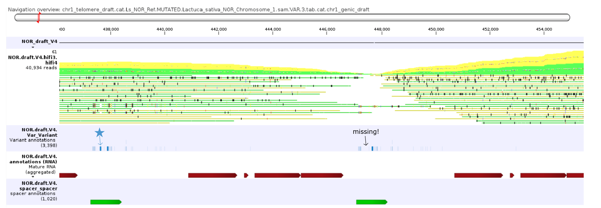
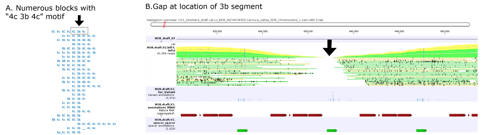
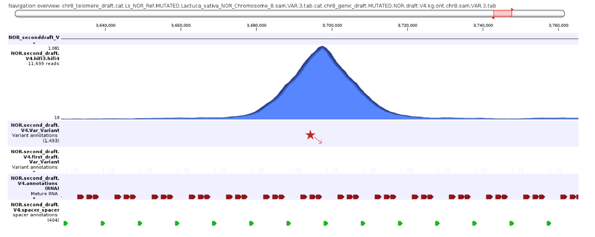

# 8. Refinement

Overview: perfect the draft generated in part 7 by iterative read mapping and consensus generation. Quality control the draft versions to ignore spurious variants incorporated from sequencing errors.

<sub>\--------------------------------------------------------------------------------------------------------------------------------------------------------------------------- </sub>

### 8a. Map reads to draft.


Note: this continues to assume two contigs, Contig_1 and Contig_2.\
Map all full length reads from the long dataset to this draft.
```bash
minimap2 -t *THREADS* --eqx -ax map-ont drafts/firstdraft.V1.fa reads/long.fa.chop.oriented.fa > drafts/firstdraft.V1.long.sam
```

<sub>\--------------------------------------------------------------------------------------------------------------------------------------------------------------------------- </sub>

### 8b. Visualize these alignments.

Load the following files in the visualization software:
- drafts/firstdraft.V1.fa
- drafts/firstdraft.V1.long.sam
- drafts/firstdraft.V1.VAR.gff
- drafts/firstdraft.V1.features.gff

There will be plenty of locations with read alignment polymorphisms. This is normal. For example, enormous insertion drafts will have many variants. These represent the sequencing errors in the read used to generate the draft.


**Check for locations that have extreme mapping coverage values**:
- Locations with coverage of zero are generally a problem. Here are a few possible reasons for this:
  1. The segment(s) is/are missing a few canonical polymorphisms that are common to segments in that region (see below). In this case:
    - Determine which variants are missing from this segment. Because tandem repeat clusters expand laterally, check the variant content of nearby segments. 
    - It is likely these missing variants appear in the variants file, but at a low coverage, so weren't included in the consensus. Check the coordinates of these skipped variants.
    - Go back to step 7d, and add the parameter --include *COORDINATE1*,*COORDINATE2* when running 07_generateConsensus.py. 


> Segment is missing a canonical insertion (depicted with a star) common to nearby segments. As a result, few reads map hear.

  2. The region was constructed upon a **phantom motif** (see below). This can exist when systematic sequencing errors create a pattern in the haplotypes. In this case:
     - Go back to step 6b, and restack this region without the phantom motif.


> (A) In step 6, the motif "4c 3b 4c" appears at high depth, and is stacked into a region. (B) Read mapping and step 8b reveals this motif is not real; rather, "3b" here is an imposter haplotype occurring from systematic sequencing or alignment error(s) causing the loss of the incorporation of certain important variants into this segment and a gap in read mapping (B). This region was reassembled (these blocks are not used) and became contiguous.

- Locations with very high coverage can also be a problem. There are a few reasons for this:
   3. A wrongly incorporated systematic sequencing error (see below). In this case:
     - Go back to step 7d, and add the parameter --exclude *COORDINATE1* when running 07_generateConsensus.py.

> A single variant corresponding to an insertion in a homopolymer rich region causes all reads containing this sequencing error to map here. Therefore, a kmer occurring a high frequency does not mean it is real.

   4. An expanded region (see step 7c). In this case:
     - Identify if there are any variants that separate reads in this region. If the coverage is 2X, they may occur in close to 50% of the reads. Identify specific blocks which correspond to one variant type. Go back to step 6b and separate out these blocks, and expand the region.


Notes:
 - Each time a new first draft is attempted, the version number can be incremented.

Once the read mapping is relatively flat, proceed to step 8c.

<sub>\--------------------------------------------------------------------------------------------------------------------------------------------------------------------------- </sub>

### 8c. Generate consensus (second draft).

Seperate read mappings by which contig they mapped to.
```bash
awk '{if(substr($1,1,1) == "@" || $3 ~ "Contig_1") {print}}' drafts/firstdraft.V1.long.sam > drafts/firstdraft.V1.long.Contig1.sam
awk '{if(substr($1,1,1) == "@" || $3 ~ "Contig_2") {print}}' drafts/firstdraft.V1.long.sam > drafts/firstdraft.V1.long.Contig2.sam
```

Call variants against each draft.
```bash
python3 scripts/04_highCoverageVariantCaller.py drafts/firstdraft.V1.long.Contig1.sam drafts/Contig_1.sam.VAR.tab.consensus.fa -c 3 -d 5
python3 scripts/04_highCoverageVariantCaller.py drafts/firstdraft.V1.long.Contig2.sam drafts/Contig_2.sam.VAR.tab.consensus.fa -c 3 -d 5
```

Collapse variants to generate a consensus.
```bash
python3 scripts/07_generateConsensus.py drafts/firstdraft.V1.long.Contig1.sam.VAR.tab drafts/Contig_1.sam.VAR.tab.consensus.fa --annotations drafts/firstdraft.V1.VAR.gff,drafts/firstdraft.V1.features.gff
python3 scripts/07_generateConsensus.py drafts/firstdraft.V1.long.Contig2.sam.VAR.tab drafts/Contig_2.sam.VAR.tab.consensus.fa --annotations drafts/firstdraft.V1.VAR.gff,drafts/firstdraft.V1.features.gff
```

Combine into a second draft.
```bash
cat drafts/firstdraft.V1.long.Contig1.sam.VAR.tab.consensus.fa drafts/firstdraft.V1.long.Contig2.sam.VAR.tab.consensus.fa > drafts/seconddraft.V1.fa
cat drafts/firstdraft.V1.long.Contig1.sam.VAR.tab.consensus.gff drafts/firstdraft.V1.long.Contig2.sam.VAR.tab.consensus.gff > drafts/seconddraft.V1.VAR.gff
cat drafts/firstdraft.V1.features.gff.firstdraft.V1.long.Contig1.sam.VAR.tab.consensus.gff drafts/firstdraft.V1.features.gff.firstdraft.V1.long.Contig2.sam.VAR.tab.consensus.gff > drafts/seconddraft.V1.features.gff
cat drafts/firstdraft.V1.VAR.gff.firstdraft.V1.long.Contig1.sam.VAR.tab.consensus.gff drafts/firstdraft.V1.VAR.gff.firstdraft.V1.long.Contig2.sam.VAR.tab.consensus.gff > drafts/seconddraft.V1.VAR.firstdraft.gff
```

Notes:
- *drafts/seconddraft.V1.VAR.firstdraft.gff* represents the variants incorporated from the original first draft, with coordinates adjusted for the second draft.

<sub>\--------------------------------------------------------------------------------------------------------------------------------------------------------------------------- </sub>

### 8d. Repeat steps 8a - 8c using the long reads to generate the third draft.


```bash
minimap2 -t *THREADS* --eqx -ax map-ont drafts/seconddraft.V1.fa reads/long.fa.chop.oriented.fa > drafts/seconddraft.V1.long.sam
```

Load the following files into the visualization software like in step 8b (but with one more file).
- drafts/seconddraft.V1.fa
- drafts/seconddraft.V1.long.sam
- drafts/seconddraft.V1.VAR.gff
- drafts/seconddraft.V1.features.gff
- **drafts/seconddraft.V1.VAR.firstdraft.gff**
The expectation is that read mapping onto the second draft should be even better, with fewer SNPs.\
Analyze the read mapping using the same instructions for 8b. Instead of "go back to step 7d", do "go back to step 8c" (generating the second draft).\

```bash
awk '{if(substr($1,1,1) == "@" || $3 ~ "Contig_1") {print}}' drafts/seconddraft.V1.long.sam > drafts/seconddraft.V1.long.Contig1.sam
awk '{if(substr($1,1,1) == "@" || $3 ~ "Contig_2") {print}}' drafts/seconddraft.V1.long.sam > drafts/seconddraft.V1.long.Contig2.sam
```
```bash
python3 scripts/04_highCoverageVariantCaller.py drafts/seconddraft.V1.long.Contig1.sam drafts/firstdraft.V1.long.Contig1.sam.VAR.tab.consensus.fa -c 3 -d 5
python3 scripts/04_highCoverageVariantCaller.py drafts/seconddraft.V1.long.Contig2.sam drafts/firstdraft.V1.long.Contig2.sam.VAR.tab.consensus.fa -c 3 -d 5
```
```bash
python3 scripts/07_generateConsensus.py drafts/seconddraft.V1.long.Contig1.sam.VAR.tab drafts/firstdraft.V1.long.Contig1.sam.VAR.tab.consensus.fa --annotations drafts/seconddraft.V1.VAR.gff,drafts/seconddraft.V1.features.gff,drafts/seconddraft.V1.VAR.firstdraft.gff
python3 scripts/07_generateConsensus.py drafts/seconddraft.V1.long.Contig2.sam.VAR.tab drafts/firstdraft.V1.long.Contig2.sam.VAR.tab.consensus.fa --annotations drafts/seconddraft.V1.VAR.gff,drafts/seconddraft.V1.features.gff,drafts/seconddraft.V1.VAR.firstdraft.gff
```
Combine into third draft.
```bash
cat drafts/seconddraft.V1.long.Contig1.sam.VAR.tab.consensus.fa drafts/seconddraft.V1.long.Contig2.sam.VAR.tab.consensus.fa > drafts/thirddraft.V1.fa
cat drafts/seconddraft.V1.long.Contig1.sam.VAR.tab.consensus.gff drafts/seconddraft.V1.long.Contig2.sam.VAR.tab.consensus.gff > drafts/thirddraft.V1.VAR.gff
cat drafts/seconddraft.V1.features.gff.seconddraft.V1.long.Contig1.sam.VAR.tab.consensus.gff drafts/seconddraft.V1.features.gff.seconddraft.V1.long.Contig2.sam.VAR.tab.consensus.gff > drafts/thirddraft.V1.features.gff
cat drafts/seconddraft.V1.VAR.gff.seconddraft.V1.long.Contig1.sam.VAR.tab.consensus.gff drafts/seconddraft.V1.VAR.gff.seconddraft.V1.long.Contig2.sam.VAR.tab.consensus.gff > drafts/thirddraft.V1.VAR.seconddraft.gff
cat drafts/seconddraft.V1.VAR.firstdraft.gff.seconddraft.V1.long.Contig1.sam.VAR.tab.consensus.gff drafts/seconddraft.V1.VAR.firstdraft.gff.seconddraft.V1.long.Contig2.sam.VAR.tab.consensus.gff > drafts/thirddraft.V1.VAR.firstdraft.gff
```


<sub>\--------------------------------------------------------------------------------------------------------------------------------------------------------------------------- </sub>

### 8e. Repeat steps 8a - 8c using the short reads to generate the fourth (final) draft.

> Long reads are more accurate at mapping. Short reads are more accurate at alignment. It is advised to produce final sequence drafts following the sequence supported by the short reads.

The expectation is that read mapping onto third draft should be even better, with fewer SNPs.\
Cleaning up and finalizing this sequence with the short reads will help resolve homopolymer regions in retrotransposon insertions.\

```bash
minimap2 -t *THREADS* --eqx -ax map-hifi drafts/thirddraft.V1.fa reads/short.fa.chop.oriented.fa > drafts/thirddraft.V1.short.sam
```
Load the following files into the visualization software like in step 8b (but with two more files).
- drafts/thirddraft.V1.fa
- drafts/thirddraft.V1.short.sam
- drafts/thirddraft.V1.VAR.gff
- drafts/thirddraft.V1.features.gff
- **drafts/thirddraft.V1.VAR.firstdraft.gff**
- **drafts/thirddraft.V1.VAR.seconddraft.gff**

Analyze the read mapping using the same instructions for 8b. Instead of "go back to step 7d", do "go back to step 8d" (generating the third draft).\

```bash
awk '{if(substr($1,1,1) == "@" || $3 ~ "Contig_1") {print}}' drafts/thirddraft.V1.short.sam > drafts/thirddraft.V1.short.Contig1.sam
awk '{if(substr($1,1,1) == "@" || $3 ~ "Contig_2") {print}}' drafts/thirddraft.V1.short.sam > drafts/thirddraft.V1.short.Contig2.sam
```
```bash
python3 scripts/04_highCoverageVariantCaller.py drafts/thirddraft.V1.short.Contig1.sam drafts/seconddraft.V1.long.Contig1.sam.VAR.tab.consensus.fa -c 3 -d 5
python3 scripts/04_highCoverageVariantCaller.py drafts/thirddraft.V1.short.Contig2.sam drafts/seconddraft.V1.long.Contig2.sam.VAR.tab.consensus.fa -c 3 -d 5
```
```bash
python3 scripts/07_generateConsensus.py drafts/thirddraft.V1.short.Contig1.sam.VAR.tab drafts/seconddraft.V1.long.Contig1.sam.VAR.tab.consensus.fa --annotations drafts/thirddraft.V1.VAR.gff,drafts/thirddraft.V1.features.gff,drafts/thirddraft.V1.VAR.firstdraft.gff,drafts/thirddraft.V1.VAR.seconddraft.gff
python3 scripts/07_generateConsensus.py drafts/thirddraft.V1.short.Contig2.sam.VAR.tab drafts/seconddraft.V1.long.Contig2.sam.VAR.tab.consensus.fa --annotations drafts/thirddraft.V1.VAR.gff,drafts/thirddraft.V1.features.gff,drafts/thirddraft.V1.VAR.firstdraft.gff,drafts/thirddraft.V1.VAR.seconddraft.gff
```

Combine into fourth draft.
```bash
cat drafts/thirddraft.V1.short.Contig1.sam.VAR.tab.consensus.fa drafts/thirddraft.V1.short.Contig2.sam.VAR.tab.consensus.fa > drafts/fourthdraft.V1.fa
cat drafts/thirddraft.V1.short.Contig1.sam.VAR.tab.consensus.gff drafts/thirddraft.V1.short.Contig2.sam.VAR.tab.consensus.gff > drafts/fourthdraft.V1.VAR.gff
cat drafts/thirddraft.V1.features.gff.thirddraft.V1.short.Contig1.sam.VAR.tab.consensus.gff drafts/thirddraft.V1.features.gff.thirddraft.V1.short.Contig2.sam.VAR.tab.consensus.gff > drafts/fourthdraft.V1.features.gff
cat drafts/thirddraft.V1.VAR.gff.thirddraft.V1.short.Contig1.sam.VAR.tab.consensus.gff drafts/thirddraft.V1.VAR.gff.thirddraft.V1.short.Contig2.sam.VAR.tab.consensus.gff > drafts/fourthdraft.V1.VAR.thirddraft.gff
cat drafts/thirddraft.V1.VAR.firstdraft.gff.thirddraft.V1.short.Contig1.sam.VAR.tab.consensus.gff drafts/thirddraft.V1.VAR.firstdraft.gff.thirddraft.V1.short.Contig2.sam.VAR.tab.consensus.gff > drafts/fourthdraft.V1.VAR.firstdraft.gff
cat drafts/thirddraft.V1.VAR.seconddraft.gff.thirddraft.V1.short.Contig1.sam.VAR.tab.consensus.gff drafts/thirddraft.V1.VAR.seconddraft.gff.thirddraft.V1.short.Contig2.sam.VAR.tab.consensus.gff > drafts/fourthdraft.V1.VAR.seconddraft.gff
```


Next step: 
